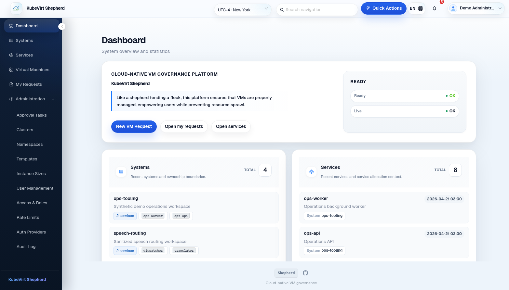

# KubeVirt Shepherd

[](https://www.apache.org/licenses/LICENSE-2.0)
[](go.mod)
[](https://github.com/kv-shepherd/shepherd/actions/workflows/ci.yml)

**[Website](https://www.kv-shepherd.io)** ·
**[Online Demo](https://demo.kv-shepherd.io)** ·
**[Documentation](docs/README.md)**

KubeVirt Shepherd is a governance-first management platform for
[KubeVirt][kubevirt] virtual machines. It provides self-service VM lifecycle
management with structured approval workflows, RBAC, quota-aware operating
models, and audit trails across multiple Kubernetes clusters.

<p align="center">
  
</p>

## Why Shepherd?

KubeVirt solves running VMs on Kubernetes. Shepherd focuses on the operating
model around those VMs: who can request them, who approves the change, how
platform permissions are enforced, which clusters are available, and where the
audit trail lives.

Shepherd is an open-source, vendor-neutral alternative for teams that need VM
governance without tying the workflow to a specific commercial platform stack.

| Capability | OpenShift Virt | Shepherd |
|------------|----------------|----------|
| Multi-cluster management | Yes, commonly with RHACM | Native |
| Approval workflows | Yes | Built in |
| Self-service portal | Operator-driven | Request -> approve -> deliver |
| Audit trail | OpenShift-integrated | Platform-native |
| Vendor lock-in | Strong OpenShift coupling | None |

## Features

- Approval workflows for create, modify, start, stop, restart, and delete
- Multi-cluster Kubernetes/KubeVirt management
- Platform RBAC plus System, Service, and VM membership inheritance
- Environment-scoped global role bindings
- Full audit trail for governed resource changes
- VNC and serial console entrypoints
- Chinese and English UI
- Auth provider plugin SDK for LDAP, OIDC, and custom integrations
- PostgreSQL-only runtime architecture with River Queue for async work

## Architecture

```text
Web UI (React 19 + Next.js 16)
  -> Go Backend (Gin)
  -> PostgreSQL 18
  -> Kubernetes/KubeVirt clusters
```

Shepherd intentionally avoids Redis and external message queues in the default
architecture. PostgreSQL stores business state, audit data, credentials, and
River background jobs. API changes are contract-first through OpenAPI, and
architecture decisions are tracked in [docs/adr/](docs/adr/).

## Project Status

Shepherd is currently **Alpha**. The core governance paths - approval workflows,
RBAC, audit trails, and VM lifecycle management - have been validated through
internal production use in a financial-services Kubernetes/KubeVirt
environment. The Alpha label is intentionally conservative while broader
external feedback is gathered across different clusters, storage classes, auth
providers, and operating policies.

See [CHANGELOG.md](CHANGELOG.md) for release details and
[ROADMAP.md](ROADMAP.md) for planned work.

## Quick Start

### Local Development

Use this path when you want to modify Shepherd or run the full stack from the
current source tree.

Prerequisites:

- Git
- Go 1.25.10 or newer
- Node.js 22 or newer with npm
- Docker 24 or newer with Docker Compose v2
- A Kubernetes/KubeVirt cluster is optional for development, but required for
  real VM lifecycle operations

```bash
git clone https://github.com/kv-shepherd/shepherd.git
cd shepherd
git pull --ff-only origin main

# Start frontend, backend, nginx, and a local PostgreSQL 18 container.
./start-dev.sh

# Start from a clean local database when you intentionally want a reset.
./start-dev.sh --clean-all
```

| Endpoint | URL |
|----------|-----|
| Web UI | `http://localhost:3000` |
| HTTPS dev ingress | `https://localhost:3443` |
| API, through ingress | `http://localhost:3000/api/v1` |
| API, direct backend | `http://localhost:8080/api/v1` |

Local development seeds only the platform bootstrap baseline:

- built-in roles
- default admin account: `admin / admin`
- first sign-in requires a password change

Common development commands:

```bash
make generate   # Ent ORM + OpenAPI + sqlc code generation
make build      # Go server binary -> bin/shepherd
make test       # Go tests; PostgreSQL packages use postgres:18 test containers

cd web
npm ci
npm run dev
```

### Deployment From Release Images

The default production path uses GitHub-published container images from GHCR
and does not require a git checkout or `git pull` on the target host. The
host needs Docker, Docker Compose v2, and outbound access to `ghcr.io` and
`raw.githubusercontent.com`.

```bash
mkdir -p shepherd-deploy && cd shepherd-deploy
curl -fsSL https://raw.githubusercontent.com/kv-shepherd/shepherd/main/deploy/prod/deploy-prod.sh | bash -s -- --with-seed
```

By default this starts the current pinned GHCR release images, bundled
PostgreSQL 18, `https://localhost`, and a generated self-signed TLS certificate
if no certificate files are present. The script writes generated secrets and
bootstrap credentials to `.env.prod`; back up that file.

All runtime overrides are optional and can be passed before `bash` only when
needed:

```bash
# Use a real external URL when a domain or ingress is ready.
curl -fsSL https://raw.githubusercontent.com/kv-shepherd/shepherd/main/deploy/prod/deploy-prod.sh | \
  SERVER_PUBLIC_BASE_URL=https://shepherd.example.com bash -s -- --with-seed

# Use an external PostgreSQL 18 service instead of the bundled container.
curl -fsSL https://raw.githubusercontent.com/kv-shepherd/shepherd/main/deploy/prod/deploy-prod.sh | \
  DATABASE_URL='<postgres-18-dsn>' DEPLOY_BUNDLED_POSTGRES=false bash -s -- --with-seed

# Pin a different GitHub Release image version. GHCR tags omit the leading "v".
curl -fsSL https://raw.githubusercontent.com/kv-shepherd/shepherd/main/deploy/prod/deploy-prod.sh | \
  SHEPHERD_VERSION=0.1.1-alpha.5 bash -s -- --with-seed
```

The first deploy should use `--with-seed` to create built-in roles and the
initial `admin` account.

Useful production commands from the deployment directory:

```bash
docker compose -f docker-compose.prod.yml -p shepherd-prod ps
docker compose -f docker-compose.prod.yml -p shepherd-prod logs -f
docker compose -f docker-compose.prod.yml -p shepherd-prod down
```

### Source Build Deployment

Use source-build deployment only when you intentionally want the target host to
build local backend and frontend images from a checkout.

```bash
git clone https://github.com/kv-shepherd/shepherd.git
cd shepherd
git pull --ff-only origin main
bash deploy/prod/deploy-prod.sh --with-seed
```

See [docs/DEPLOYMENT.md](docs/DEPLOYMENT.md) for the full deployment guide,
configuration reference, security checklist, manual compose flow, and VPS
experience seed setup.

### Helm Deployment

A Helm chart is the next Kubernetes-native deployment target. It is not shipped
in this repository yet. The chart should use the same GHCR release images,
prefer an external PostgreSQL 18 database, and map the current compose
configuration into Kubernetes Secrets, Deployments, Services, Ingress, and
health probes.

Until the chart lands, use the release-image Docker Compose deployment above
for production and VPS installs.

## Documentation

- [docs/README.md](docs/README.md) - Documentation index and quick start
- [docs/DEPLOYMENT.md](docs/DEPLOYMENT.md) - Deployment guide and security checklist
- [docs/adr/](docs/adr/) - Architecture Decision Records
- [docs/design/](docs/design/) - Design and implementation notes
- [docs/RELEASE.md](docs/RELEASE.md) - Release process
- [ADOPTERS.md](ADOPTERS.md) - Organizations using Shepherd

## Community

Feedback from real environments is especially useful while the project is in
Alpha.

- [GitHub Issues][issues] - Bug reports and feature requests
- [Contributing](CONTRIBUTING.md) - PR workflow, CI gates, and coding standards
- [Code of Conduct](CODE_OF_CONDUCT.md) - Community standards
- [Governance](GOVERNANCE.md) - Project governance
- [Security](SECURITY.md) - Vulnerability reporting

## License

Apache License 2.0 - See [LICENSE](LICENSE).

Copyright The KubeVirt Shepherd Authors.

[kubevirt]: https://kubevirt.io
[issues]: https://github.com/kv-shepherd/shepherd/issues
